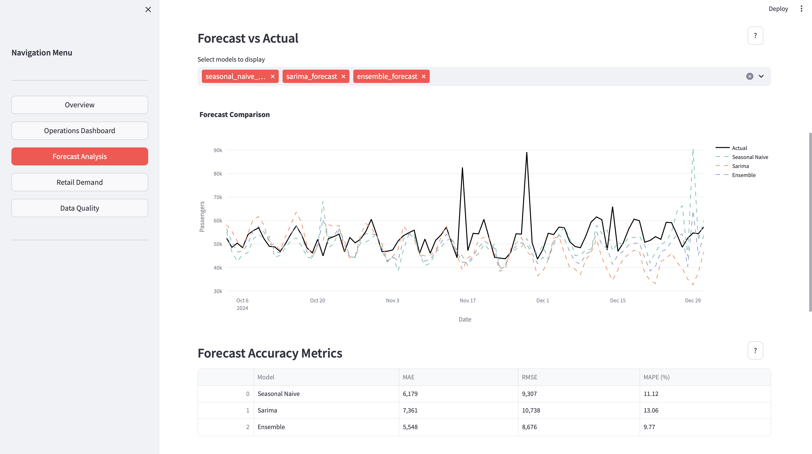

# Airport Operations & Retail Demand Intelligence Platform

A comprehensive end-to-end data analytics platform that combines automated ETL pipelines, time series forecasting (ARIMA/SARIMA + Machine Learning), and interactive dashboards to support airport operations management and retail demand planning.



---

## Overview

This platform demonstrates full-stack data analytics capabilities including:

- **Automated ETL Pipeline**: Data extraction, transformation, validation, and storage
- **Advanced Forecasting Models**: Statistical time series (ARIMA/SARIMA) and machine learning (XGBoost) with ensemble methods
- **Interactive Business Intelligence Dashboard**: Real-time analytics and visualizations
- **Data Quality Assurance**: Automated validation and monitoring systems

Built with production-ready practices and designed to be easily extensible for real-world deployment.

---

## Technology Stack

### Core Technologies
- **Python 3.9+** (3.9, 3.10, 3.11 recommended; 3.12 supported with minimal requirements)
- **Streamlit** - Interactive web dashboard framework
- **Pandas** - Data manipulation and analysis
- **NumPy** - Numerical computations

### Data Science & Machine Learning
- **scikit-learn** - Machine learning utilities and preprocessing
- **XGBoost** - Gradient boosting for regression tasks
- **statsmodels** - Statistical modeling (ARIMA/SARIMA time series models)
- **LightGBM** - Alternative gradient boosting framework (optional)

### Data Visualization
- **Plotly** - Interactive charts and visualizations
- **Matplotlib** - Static plotting (support)
- **Seaborn** - Statistical visualization (support)

### Data Validation & Quality
- Custom validation framework with automated quality checks
- JSON-based validation result storage

### Development & Deployment
- **Git** - Version control
- **pytest** - Unit testing framework
- **python-dotenv** - Environment variable management
- **Virtual Environments** (venv) - Dependency isolation

### Data Storage
- **CSV** - Primary data storage format (human-readable, version-controllable)
- **SQLAlchemy** - Database abstraction layer (for future PostgreSQL integration)
- **Pickle** - Model serialization

---

## Project Structure

```
FlowCast/
├── app/                           # Streamlit Dashboard Application
│   ├── main.py                    # Dashboard entry point and routing
│   ├── page_modules/              # Dashboard page modules
│   │   ├── overview.py            # Project overview and key metrics
│   │   ├── operations.py          # Operational analytics dashboard
│   │   ├── forecast.py            # Forecasting model analysis
│   │   ├── retail.py              # Retail demand analysis
│   │   └── data_quality.py        # Data quality monitoring
│   └── utils.py                   # Shared utility functions
│
├── etl/                           # ETL Pipeline
│   ├── extract.py                 # Data generation and extraction
│   ├── transform.py               # Data cleaning and transformation
│   ├── validate.py                # Data validation and quality checks
│   ├── load.py                    # Data storage
│   └── run_pipeline.py            # Pipeline orchestration
│
├── models/                        # Forecasting Models
│   ├── baseline.py                # Baseline forecasting models
│   ├── arima.py                   # ARIMA/SARIMA implementation
│   ├── ml_models.py               # XGBoost with feature engineering
│   ├── ensemble.py                # Ensemble methods
│   ├── evaluate.py                # Model evaluation metrics
│   └── train_models.py            # Model training orchestration
│
├── data/                          # Data Storage
│   ├── raw/                       # Raw generated data
│   ├── processed/                 # Cleaned and validated data
│   ├── models/                    # Trained models and forecasts
│   └── outputs/                   # Additional outputs
│
├── tests/                         # Unit tests
├── config.py                      # Configuration management
├── requirements.txt               # Python dependencies (Python 3.9-3.11)
├── requirements-minimal.txt       # Minimal dependencies (Python 3.12)
├── setup.sh                       # Automated setup script
└── Makefile                       # Development automation
```

---

## Prerequisites

- **Python 3.9+** (3.9, 3.10, or 3.11 recommended for full feature support)
- **pip** - Python package manager
- **Terminal/Command Line** - Basic command-line knowledge
- **Web Browser** - For accessing the dashboard (Chrome, Firefox, Safari, or Edge)

---

## Installation & Setup

### Step 1: Clone the Repository

```bash
git clone <repository-url>
cd FlowCast
```

### Step 2: Create Virtual Environment

```bash
# Create virtual environment
python3 -m venv venv

# Activate virtual environment
# On macOS/Linux:
source venv/bin/activate
# On Windows:
venv\Scripts\activate
```

### Step 3: Install Dependencies

**For Python 3.9, 3.10, or 3.11:**
```bash
pip install -r requirements.txt
```

**For Python 3.12 (minimal requirements - excludes some optional packages):**
```bash
pip install -r requirements-minimal.txt
```

**Alternative: Use automated setup script**
```bash
chmod +x setup.sh
./setup.sh
```

---

## Quick Start Guide

### 1. Generate and Process Data (ETL Pipeline)

Run the complete ETL pipeline to generate synthetic data, clean it, validate it, and store it:

```bash
python -m etl.run_pipeline
```

**What this does:**
- Generates synthetic passenger traffic data (2020-2024) with realistic patterns
- Generates weather data (temperature, precipitation, humidity)
- Creates holiday calendar
- Generates retail sales data correlated with passenger volume
- Cleans data (removes duplicates, handles missing values, caps outliers)
- Validates data quality (checks for negatives, reasonable ranges, completeness)
- Saves cleaned datasets to CSV files in `data/processed/`

**Expected output:**
- Processed datasets in `data/processed/`
- Validation results in JSON format
- Merged dataset combining all sources

**Time:** ~30 seconds to 2 minutes depending on system

### 2. Train Forecasting Models

Train all forecasting models on the processed data:

```bash
python -m models.train_models
```

**What this does:**
- Trains baseline model (Seasonal Naive forecasting)
- Trains ARIMA/SARIMA models with automatic parameter selection
- Trains XGBoost model with feature engineering (lags, rolling statistics, time features)
- Creates ensemble model combining all approaches
- Evaluates model performance (MAE, RMSE, MAPE metrics)
- Saves trained models and forecast results

**Expected output:**
- Trained models in `data/models/`
- Forecast results in `data/models/forecast_results.csv`
- Model performance metrics

**Time:** 2-10 minutes depending on system performance

### 3. Launch Interactive Dashboard

Start the Streamlit web application:

```bash
streamlit run app/main.py
```

The dashboard will automatically open in your default web browser at `http://localhost:8501`

**Dashboard Pages:**
1. **Overview** - Project introduction, key metrics, and system architecture
2. **Operations Dashboard** - Passenger traffic analysis, trends, and anomaly detection
3. **Forecast Analysis** - Model comparison, accuracy metrics, and future predictions
4. **Retail Demand** - Sales analysis, correlation with passenger volume, and staffing recommendations
5. **Data Quality** - Validation results, quality scores, and data freshness monitoring

**To stop the dashboard:** Press `Ctrl+C` in the terminal

---

## Using Makefile Commands

The project includes a `Makefile` for common tasks:

```bash
# Setup virtual environment and install dependencies
make setup

# Run ETL pipeline
make etl

# Train models
make train

# Run dashboard
make dashboard

# Run all: ETL + Train + Dashboard (sequential)
make all

# Clean generated data and models
make clean
```

---

## Dashboard Features

### Overview Page
- Project architecture diagram
- High-level KPIs (total passengers, daily averages, data coverage)
- Overall passenger traffic trends
- Model performance summary

### Operations Dashboard
- Operational metrics with date range filtering
- Daily passenger traffic trend visualization
- Year-over-year growth analysis
- Monthly aggregation charts
- Statistical anomaly detection (identifies unusual days)

### Forecast Analysis
- Model performance comparison (MAE, RMSE, MAPE)
- Forecast vs actual comparison charts
- Multi-model selection and visualization
- Future forecast projections with adjustable horizon
- Model accuracy metrics table

### Retail Demand Analysis
- Retail performance metrics (total sales, conversion rates)
- Sales trend visualization
- Sales vs passenger volume correlation analysis
- Category breakdown (Duty Free, Food & Beverage, Retail, Services)
- Staffing recommendations based on passenger forecasts
- Monthly sales analysis

### Data Quality Monitoring
- Overall data quality score (percentage)
- Recent validation check results with filtering
- Check status breakdown by dataset type
- Failed checks details
- Data freshness information (last update dates)

**Interactive Features:**
- Date range filters for time-based analysis
- Model selection (multi-select dropdowns)
- Interactive charts (zoom, pan, hover tooltips)
- Help tooltips (?) on each section explaining concepts
- Real-time data loading from CSV files

---

## Troubleshooting

### Dependency Installation Issues

**Problem:** Packages failing to install (especially on Python 3.12)

**Solution:**
```bash
# Use minimal requirements
pip install -r requirements-minimal.txt

# Or use Python 3.11
brew install python@3.11  # macOS
python3.11 -m venv venv
source venv/bin/activate
pip install -r requirements.txt
```

### Module Not Found Errors

**Problem:** `ModuleNotFoundError` when running scripts

**Solution:**
```bash
# Ensure virtual environment is activated (you should see (venv) in prompt)
source venv/bin/activate

# Reinstall dependencies
pip install -r requirements-minimal.txt
```

### No Data in Dashboard

**Problem:** Dashboard shows "No data available" messages

**Solution:**
```bash
# Run ETL pipeline first
python -m etl.run_pipeline

# If training models, also run:
python -m models.train_models

# Refresh browser
```

### Port Already in Use

**Problem:** Port 8501 is already in use

**Solution:**
```bash
# Find process using port
lsof -i :8501  # macOS/Linux
netstat -ano | findstr :8501  # Windows

# Kill the process (replace <PID> with process ID)
kill -9 <PID>  # macOS/Linux
taskkill /PID <PID> /F  # Windows

# Or use different port
streamlit run app/main.py --server.port 8502
```

### Import Errors in Models

**Problem:** Errors related to XGBoost or LightGBM

**Solution:**
```bash
# These are optional for core functionality
# Use minimal requirements which excludes them:
pip install -r requirements-minimal.txt

# Core models (ARIMA, baseline) will still work
```

---

## Key Metrics & Performance

### Model Performance
- **Ensemble Model**: Typically achieves lowest error rates by combining multiple approaches
- **XGBoost**: Strong performance with feature engineering
- **ARIMA/SARIMA**: Effective for capturing seasonal patterns
- **Baseline Models**: Provide benchmarks for comparison

### Data Processing
- **ETL Pipeline**: Processes 5+ years of daily data in under 2 minutes
- **Model Training**: Complete training pipeline in 2-10 minutes
- **Dashboard Loading**: Near-instantaneous data loading from CSV

---

## Development & Customization

### Adding New Data Sources
1. Add extraction function in `etl/extract.py`
2. Add transformation logic in `etl/transform.py`
3. Add validation rules in `etl/validate.py`
4. Update merge function to include new data
5. Update dashboard pages to visualize new data

### Adding New Forecasting Models
1. Create model implementation in `models/`
2. Add training logic to `models/train_models.py`
3. Include in ensemble method if desired
4. Update dashboard to display new model forecasts

### Adding New Dashboard Pages
1. Create new page file in `app/page_modules/`
2. Import and route in `app/main.py`
3. Use utility functions from `app/utils.py`
4. Follow existing page structure and styling

---

## Technical Highlights

### Data Engineering
- Automated ETL pipeline with error handling
- Data validation framework with quality scoring
- Synthetic data generation with realistic patterns
- CSV-based storage for portability and version control

### Machine Learning & Forecasting
- Multiple model types (statistical + ML) for robust predictions
- Feature engineering (lag features, rolling statistics, time encoding)
- Ensemble methods for improved accuracy
- Comprehensive model evaluation metrics

### Software Engineering
- Modular architecture with clear separation of concerns
- Configuration management
- Error handling and graceful fallbacks
- Code organization following best practices
